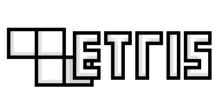
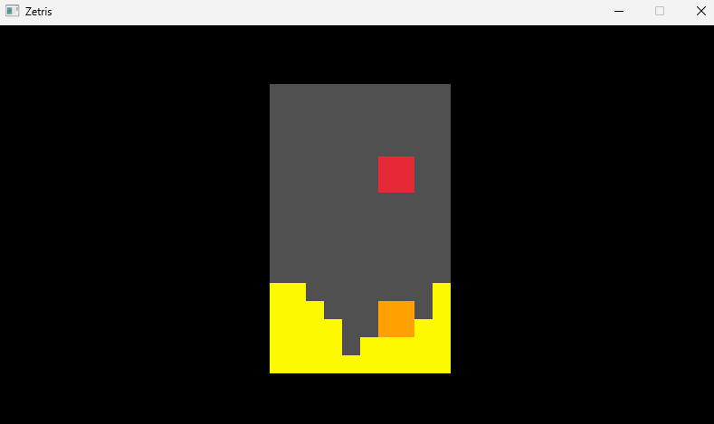

<div align="center">



# Zetris



</div>

## Rules
Zetris is a game where you place a set of blocks into an enclosed grid one at a time.
When a row is filled its blocks vanish, and the subsequent rows above fall simulating gravity. As time goes on,
the blocks start to fall faster. You don't want the blocks to reach above the visible screen, or else its game over.
You can move horizontally, drop, or rotate each block as its falling. You can even hold a block for later if you can't fit it quite yet.
## How It Works
- Blocks are set up with a 16 bit integer. Rotated with a function to swap x & y indices.
- Playfield is (at max) a 32 element array of 32 bit integers
- Bitwise math is done to check for collisions
- In order to run the same independent of framerate, delta time is used with x and y accumulators (velocity) to allow for "half" cell values.
- There is intended to be a terminal & raylib version. Only the raylib version works right now. Some more effort needs to go into the rendering and input.


## Clone, Build & Run

### Clone
```
git clone https://github.com/ZeroYaHero/Zetris.git
```
Navigate to repository:
```
cd zetris
```
### Build
Configure and generate build files under `build` directory using `CMakeLists.txt` in project root directory:
```
cmake -S . -B build
```
You can also specify CMake build type: Debug adds some additional prints for sanity tests:
```
cmake -S . -B build -DCMAKE_BUILD_TYPE=[<build-type>]
```
Build in build directory
```
cmake --build build
```

### Run
```
zetris.exe
```